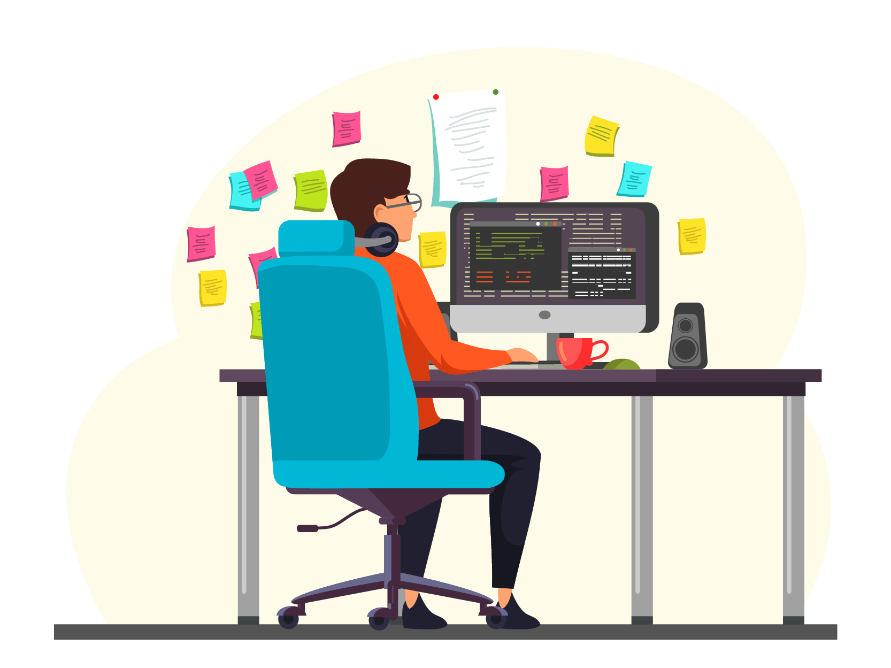
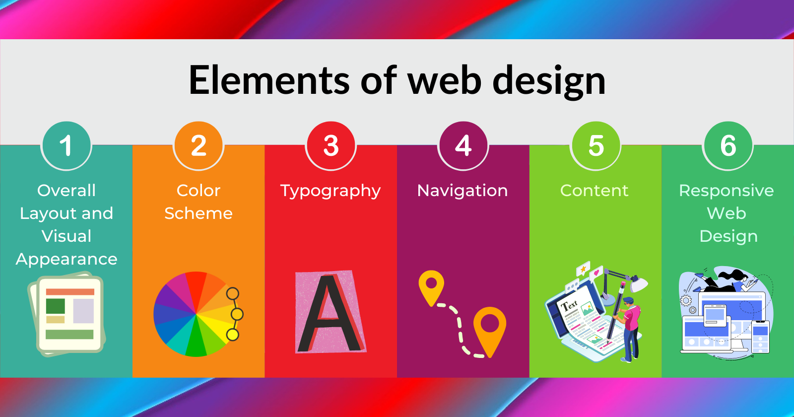
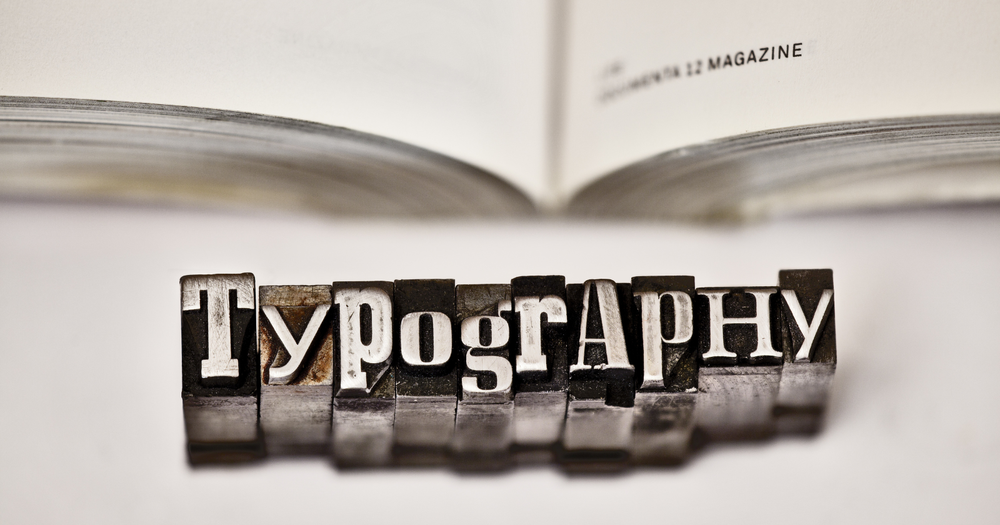
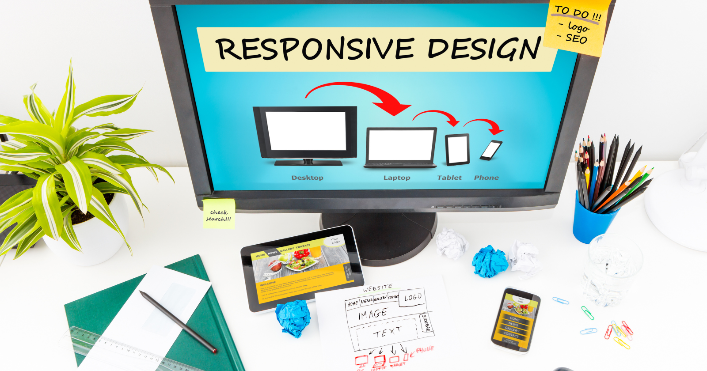

 `Hello👋 and welcome to "web design for beginners"`

> Web design is an essential part of the web development process. If you're interested in web design, we're assuming you have a creative habit. And how could you not be excited about getting started and creating your own website? Web design is about creating a useful piece of art, but where do you start? If you're wondering what you need to know before you begin, this tutorial series "**web design for beginners**" will guide you out.

## What is Web Design?

Web design, or web designing, is the building of websites and web pages to reflect a company’s identity and information and ensure a user-friendly experience. Appearance and design are featured as key factors, whether you’re designing a website, mobile app or managing content on a website. You can learn web design to create a site for your own business or become a professional web designer to produce sites for clients. In the very first article of the web design for beginners series, we will explain what web design is as well as its typical aspects and uses.

## What Does a Web Designer Do?

As a web designer, you are responsible for important decisions like the menus provided on the site as well as little details like the font, color, and graphics to choose.

A web designer creates the layout and design of a website. In simple terms, a website designer makes a site look attractive. They use design programs to produce visual elements. Website designers generally have skills in UI, or user interface, which means they intentionally design a site that’s convenient and simple for users to navigate.
 
A website's appearance has a direct impact on a user's view of the site and the company. Your work as a website designer could have a direct impact on a company's reputation. According to a study, it takes less than one second for website visitors to judge a website, and that first impression is generally connected to the brand as well. According to Kinesis Inc., research reveals that 75 percent of consumers admit that they rate organizations' credibility based on their website design.

Web designers are the professionals who carry out this process, and their responsibilities include the following:

- Choosing easy-to-read fonts
- Choosing attractive color schemes that also allow for easy-to-read fonts
- Including a brand's identity in the colors, fonts, and design of the website
- Making a map of the structure of the website to ensure easy navigation
- Inserting images, logos, text, videos, applications, and other elements
- Creating layouts and styling pages with coding languages such as **HTML** and **CSS**
- Creating mobile and desktop optimized versions of websites and pages

## Elements of web design

Thanks to the web design process, designers can adapt to any preferences and provide effective solutions.

Every web design involves many standard components, such as:

### Overall Layout and Visual Appearance

The layout of the website is how the content is displayed on a web page. Choosing the layout is an important task for the designer. It should be easy, intuitive, and approachable. Web designers can use blank areas called "white spaces" to organize the components of the site with grid-based designs to keep them in order.

Designers can build specialized layouts for desktop screens and mobile devices. Mobile-friendly websites are a must because many visitors browse websites on their smartphones or tablets. To guarantee a website is ready for mobile users, the designer can use a responsive layout that adapts to multiple screen sizes or a mobile-only look that will activate when a non-desktop device connects to the website. A consistent layout between supports contributes to the visitors' trust.

People are visual creatures, so using great graphics to make your website more appealing is a good idea. Your website has approximately 1/10th of a second to impress your visitor (and potential customer) and let them know that your website (and, by extension, your business) is reliable and professional. However, it's important not to go completely off the rails with the amount of time you spend on it. Scrolling text, animation, and flash intros should be used infrequently and only to convey a message for maximum effect in your web design.

### Color Scheme

A color scheme is the aesthetic style of a piece of art, consisting of the color choices used to create it. When making a decision about what colors to use, your first step should be choosing a theme. A theme is something that stands out from the rest, something that sets you apart from everyone else. Themes are often associated with certain moods or feelings, which helps guide your choice. 

Choosing a color scheme that's right for you can be subjective since there are so many ways to express yourself visually. You may want to consider your personality type and how you feel at different times. There are various types of color schemes, including monochromatic color schemes, triadic color schemes, and analogous color schemes. Monochromatic schemes start with one primary hue (a single shade) and then add one or more complimentary shades to complete the composition. Triadic schemes consist of three complementary colors arranged in a triangle shape. Analogous color schemes have similar tones of color placed close together. These arrangements tend to look good together, rather than being contrasting.

### Typography

Typography is the art of arranging typeface designs, sizes, and styles to create visual communication messages. In short, typography does not refer to how text looks, but rather how it’s arranged and presented. 

There are many types of fonts, each having their own characteristics. Web designers pick one or a combination of ones that is attractive and easy to read. To make the best choice, web designers should choose a font that corresponds to the target audience. Some sites may be better in serif fonts, while others can use non-serif fonts, depending on the site's industry, purpose, and typical user.

### Navigation

Navigation means moving between pages. When you visit a website and read content, you are actually navigating between pages. Browsers have built-in features that allow you to do this. In addition to reading content, you can also search for things, bookmark sites, save them for later, share links with others, and much more.

The navigational elements are the tools that allow users to determine where they need to go within a website. They may be present in the header, body, and footer of the website, depending on the site's layout and structure. These elements are important since they bring visitors to the information they desire as quickly and efficiently as possible.

Designers can choose from a variety of navigation designs and layouts, such as using a button that hides and unhides navigation menus. They can also include one-click arrows and other buttons that send users back to the top of a page, to a specific area of a page, or to another website entirely.
 
### Content

"Content" is a term used to describe the information that appears on websites. It is a vital part because your site visitors and potential customers want information immediately. 

Is your brand trustworthy? Is it knowledgeable? Is it capable of providing top-notch products and services? Given people’s short attention spans and lightning-fast first impressions, communicating properly is crucial. Information should be easy to read and digest.

### Responsive Web Design

A responsive website displays content at the correct size based on the device it's being displayed on. 

In the early days, mobile websites were often not responsive (i.e., they would look just fine on a desktop computer, but poorly on a smartphone), while many modern sites now have a single version that works on desktop computers, smartphones, tablets, etc.
 
## Web Design for Beginners

If you're new to web design, this series on web design for beginners will teach you everything you need to know. You will learn :
- ### HTML for Structure

HTML is an abbreviation for **HyperText Markup Language**. It is a standard markup language for creating web pages. It enables the creation and structure of sections, paragraphs, and links through the use of HTML elements (web page building blocks) such as tags and attributes.

- ### CSS for Presentation

CSS stands for **Cascading Style Sheets**. In the world of web design, CSS (Cascading Style Sheets) is an umbrella term referring to different techniques that allow designers to easily change the look and feel of web pages without having to mess around with HTML code.

- ### JavaScript for Behavior
JavaScript is a scripting language that runs inside web browsers. It provides users with a way to add behavior, formatting, and animations to web documents. This means that JavaScript can run in different places depending on what kind of document is being loaded.